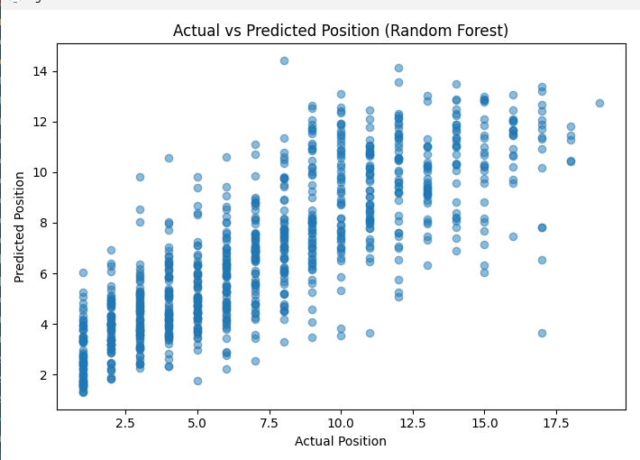
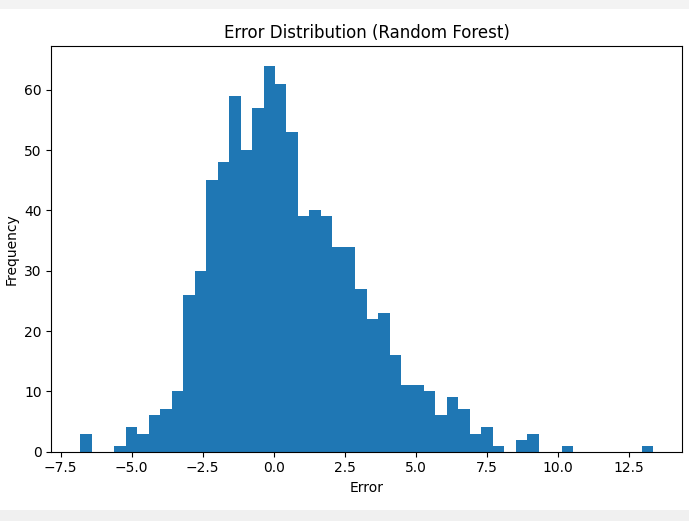
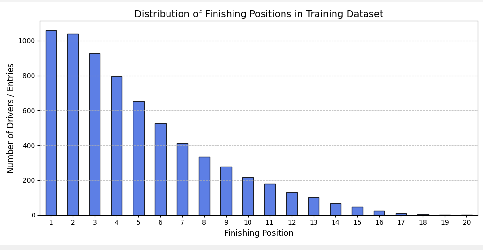
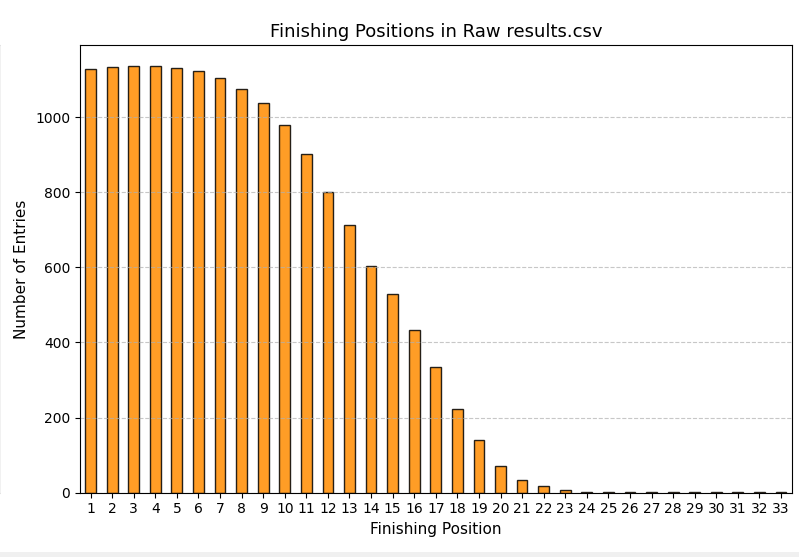
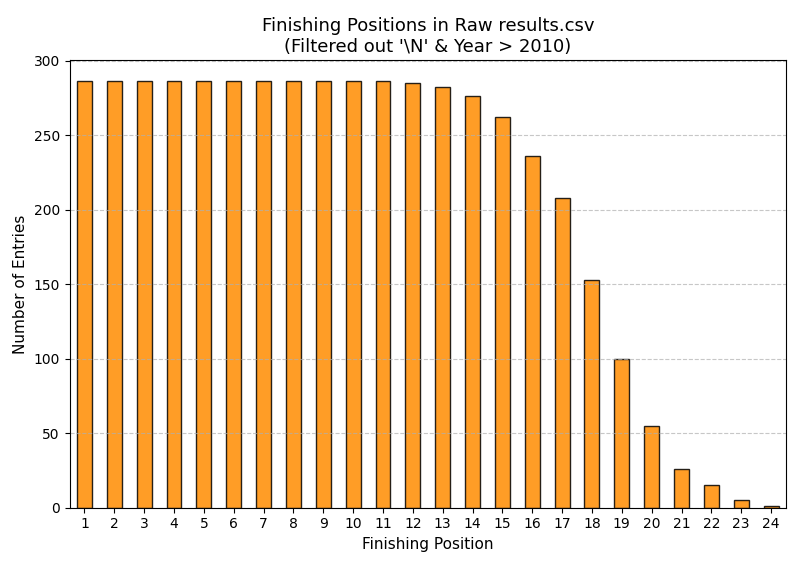

ASSUMPTIONS:
1.  For now the dataset has been filtered to remove all the DNFs, so if a driver will certainly finish then what would be a position
    is our predictive statement.

V1:
I tried a normal random forest regressor model on the cleaned dataset as specified above without any
data cleaning or manipulation and got the following results:

test score: 0.5639941486914555:  near 50% score
MAE: 2.3805787476280837: Predicts position with an error of 2-3 places on average

Ive come to realise after getting recommended by gemini that currntly we are using data from 2023
to predict race results for 2012 which will not be accurate obviously. So the train data should be based
on some previous year data and the test data on the recent years or so.
So now for the training set: Races before 2022 and test set: Races in and after 2022.

V2:
I tried a normal random forest regressor now on the filtered dataset based on the year and got the following result:

test score: 0.5310974698056856
MAE: 2.732026374086936

It turns out that now becuase the model has no knowledge of the recent year's performance it wont take into account
that a driver or a team may enhance its performance. So we need to also filter that dataset to use the face that a driver 
bad at this point may become good later on.
We dropped the following features: "position", "resultId", "raceId", "year". but later on i decided to take back year as a feature
because it may help with learning trends over time.

V3:
Adding rounds as a column because we need to calculate the avg poition of the driver in one entry for the last 3 races. 
For that we'll need to sort the tuples in chronological order which cannot be done by circuitId because they are radndom foreign
keys. However it can be done using the year and round columns.
Added 4 new features: avg position of driver in last 3 races, avg position of driver in last 5 races, avg position of constructor
in last 3 races, avg position of constructor in last 5 races. After this dropped the year column bacuse more local data is availible 
now in each tuple to be trained on. FInal scores improved:

test score: 0.6078553981108097
MAE: 2.4715758591785417

For now the feature importanc for the model is as follows:
                      feature  importance
2                        grid    0.413149
7  constructor_avg_pos_last_5    0.186300
6       driver_avg_pos_last_5    0.096717
0                    driverId    0.075030
5  constructor_avg_pos_last_3    0.062394
3                   circuitId    0.060406
1               constructorId    0.054938
4       driver_avg_pos_last_3    0.051066

As excpected logically the grid position must play the most important role in predicting a drivers finishing position.
An interesting point to observe is that the model is now paying more importance to a drivers local past performance rather than just his identity.
Let's try adding the last 3 and last 5 grid positions also for a driver.

Improved the result slightly:

test score: 0.6134855242956918 (increase of 0.01)
MAE: 2.460502933780386
                        feature  importance
2                          grid    0.399316
7    constructor_avg_pos_last_5    0.165921
6         driver_avg_pos_last_5    0.080220
0                      driverId    0.054049
5    constructor_avg_pos_last_3    0.044583
3                     circuitId    0.039675
1                 constructorId    0.039186
11  constructor_avg_grid_last_5    0.038310
10       driver_avg_grid_last_5    0.036819
9   constructor_avg_grid_last_3    0.036673
4         driver_avg_pos_last_3    0.033331
8        driver_avg_grid_last_3    0.031917

The point is not about how big the newly implemented temporal feature individually is important, but rather how much do these 
small features collectively improve the accuracy.
Let's now try and establish some baseline parameters to test if our model beats basic reasoning yet. Though one domain specific baseline, which
is the initial grid position is already satified having the highest imporance, we will look for some more such naive and domain baselines.

......Baseline Statistics......
Mean Baseline MAE: 4.555861655409195
Median Baseline MAE: 4.740150880134116
Grid Baseline MAE: 3.2087175188600168
Driver Form Baseline MAE: 2.72689298686784

As seen our model till now does a good job. It has on average a 50% better MAE than the naive baseline staistics.
Also the driver form is the last 5 races avg position becuase it as such a high importance, the its MAE is closer to the overall test MSE
than the naive baselines.

Another thing to notice that the constructor last 5 position history is more important than driver's last 5 position history which makes sense
becuase the car structure and configurations make play a huge role in the F1 race results.

Now we are going to focus on examples that are incorrectly predicted by the model and analyze those.
Key realization: On looking at the examples which contribute mmost to the errors, the very first tuple was of an austrian gp where 
max verstappen started from pos 2 but ended at pos 20 because of a dnf but he was stil awarded a position and "status 17" which my model currently doesnot filter out.
So it becomes a dataset discovery that we have to look into. Looking furthur into the status column from teh results table to further fuiter out incidents
in a race.

V4:
Now keeping only those entries that have statusId=1 which means only finished tuples. Gives a significant improvement over the previous data:
test score: 0.6170301809052453
MAE: 2.0917011494252873 

......Baseline Statistics......
Mean Baseline MAE: 4.006233317791428
Median Baseline MAE: 4.319540229885058
Grid Baseline MAE: 2.952873563218391
Driver Form Baseline MAE: 2.320536398467433

......Feature Importances......
                        feature  importance
7    constructor_avg_pos_last_5    0.297207
2                          grid    0.230021
6         driver_avg_pos_last_5    0.107526
5    constructor_avg_pos_last_3    0.054753
0                      driverId    0.053096
3                     circuitId    0.043051
11  constructor_avg_grid_last_5    0.037399
10       driver_avg_grid_last_5    0.037048
1                 constructorId    0.036069
9   constructor_avg_grid_last_3    0.035327
4         driver_avg_pos_last_3    0.035160
8        driver_avg_grid_last_3    0.033343

One thing to note is that the constructor avg points now matter more than the grid position in the overall data. 
The main thing is that there is a significant increase in the MAE which signifies that one of the main error causing factors were the disasters
and unpredicable anomalies in the race leading to retirement of the driver.

Plotted the graphs to get some info,  found some intersting insights in the the current model.

As we can observe the model hardly predicts over the position 12 and never predicts above 14, so it is interestingly very cautious about outliers, and has started acting like a gausian classifier prediciting more around the mean.
(The error distribution also started following a gausian distribution.)
Maybe it dosent predict over 14 because the training data was based on data before 2022 and in that period the overall grid did not have 20 drivers, but far less if we look back to the early 2000s.

Here we can see that the error distribution is cenbtered around 0. This is a very good sign because the maximum frequency errors are around 0. Also the errors are not very large which signifies that the model is on average not very wrong in its predictions.

Back to the previous issue, my previous hypothesis turns out to be wrong because:
Average maximum grid position across all years in the training set: 20.9444
And the earlier years even had 31 as the max grid position. So there has to be something else.

After looking things up I recalled that a random forest averages the results that all lie in a single leaf so the prediction is being automatically driven towards its mean.
We are basiclly observing "Regression to the Mean".

Actually found the issue:

The dataset is highly skewed towards the first few positions. So if we want to predict position for a driver who came 18th, the maximum position that the model has encountered is likey 12th so it is never vonfident to predict 18 or even near it.

INTERSTING:
We have some rally good insights now about the sport itself.

Observing this graph of finishing poitions in the raw data, we can clearly see that the finishing poisitions start dropping after 10 very evidently.
So as one might think that our filtering of data on DNF and keeping only statusId 1 might be hurting and skewing the training set, in reality it is the original data that is skewed. Now the main reason for this skewing is that in the earlier data because the grids were very large and the grids became smaller by time, so the occurances of positions 1-10 is present in almost every year, but the later ones are relatively present in only the earlier years which decrease their frequency relatively. 
This makes me think that the data before 2000s might just be hurting our model by skewing the data towards the earlier positions.

Proves my point. The data  after 2010 has a much more balanced distribution of poitions because the grid size is almost constant (20-22).
So the model should be able to predict higher positions with more confidence now. Lets use the model on a filtered dataset now.
Found the sweet spot to be 2000:

test score: 0.630805984657109
MAE: 2.0615954022988507 
Train MAE: 1.1384664697605673 
Minute signs of overfitting right now.

Now I implemented hyperparameter testing using a cross-validation set on the train set:
It defines a search space (param_dist) covering different values for n_estimators, max_depth, min_samples_leaf, and max_features.
It uses 3-Fold Time-Split Cross-Validation to run 10 random combinations of these parameters.
It evaluates configurations using Mean Absolute Error (neg_mean_absolute_error) so that it directly optimizes to minimize your prediction error.
It prints the best parameters found and sets model to the best estimator, letting the rest of your evaluation, error analysis, and plotting execute automatically.

One more error ive just realised: Because the training set is only previous consecutive year's data, we might not have enough information about any new rookie driver in the recent years.
Now we will try to replace driverId which is just an arbitrary number wrt the driver's perfomance with something more meaningful, a metric that might represent the drivers performance or strength. Because this metric will only be calculated using the trsainng set, for any new driver in the test set well assign the metric to be the average, which makes sense because any new driver any new driver will be predicted to perform average of the overall grid performance. Later on we can also use the team history to assign a better metric to the team.

test score: 0.5919947975045379
Test MAE: 2.164072901684544
Train MAE: 1.1559468208571777 

Something unexpected happen, on encoding driver ids, we ended increasing the overall mae also the feature importance for grid increased from 0.25 to 0.5.
So a very logical explanation for this can be that in F1 a drivers average does not always tell us about the current form of the driver.
The performance is highly seasonal, so we might want to revert back to using driver Id because the model somehow learns to ignore the driverID feature and focus more on the temporal features we made earlier.

Found this somewhere :)
Reason 2: Random Forests don't dislike IDs as much as people think
This is a huge misconception online.
People often say:
Never use IDs.
That advice is mostly for:
Linear Regression
Logistic Regression
Neural Networks
Not Trees.

Also added 2 new features for driver's points before that race and constructor points before that race. Also the point table was different for different years, so we normalized it by dividing each point score with the total points of that year.
......Overall Test Results (Random Forest)......
test score: 0.6228788412115549
Test MAE: 2.0288273847466685
Train MAE: 1.5353262270508852 

Using hyperparameter testing and the same changes for XFBOOST gives us a better result:
......Overall Test Results (XGBoost)......
test score: 0.6507123112678528
Test MAE: 1.9538066387176514
Train MAE: 1.7062007188796997 